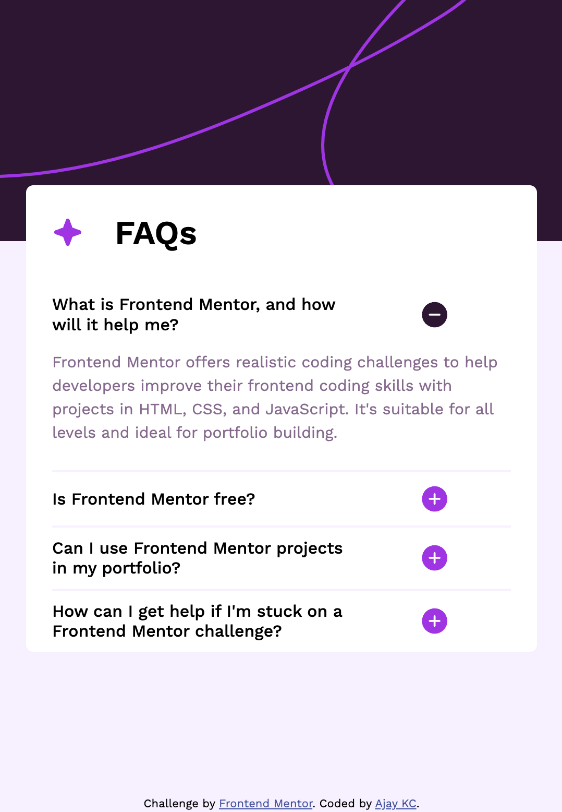

# Frontend Mentor - FAQ accordion solution

This is a solution to the [FAQ accordion challenge on Frontend Mentor](https://www.frontendmentor.io/challenges/faq-accordion-wyfFdeBwBz). Frontend Mentor challenges help you improve your coding skills by building realistic projects.

## Table of contents

- [Overview](#overview)
  - [The challenge](#the-challenge)
  - [Screenshot](#screenshot)
  - [Links](#links)
- [My process](#my-process)
  - [Built with](#built-with)
  - [Useful resources](#useful-resources)
- [Author](#author)
- [Acknowledgments](#acknowledgments)

## Overview

### The challenge

Users should be able to:

- Hide/Show the answer to a question when the question is clicked
- Navigate the questions and hide/show answers using keyboard navigation alone
- View the optimal layout for the interface depending on their device's screen size
- See hover and focus states for all interactive elements on the page

### Screenshot



### Links

- Solution URL: [https://github.com/ajay117/faq-accordion-main](https://github.com/ajay117/faq-accordion-main)
- Live Site URL: [https://ajay117.github.io/faq-accordion-main/](https://ajay117.github.io/faq-accordion-main/)

## My process

### Built with

- Semantic HTML5 markup
- CSS custom properties
- Flexbox
- Mobile-first workflow

## Author

- Website - [https://github.com/ajay117](https://github.com/ajay117)
- Frontend Mentor - [@ajay117](https://www.frontendmentor.io/profile/ajay117)
- Twitter - [@AjayInTech](https://twitter.com/AjayInTech)

## Acknowledgments

Acknowledgment to ChatGPT for the following CSS code snippet

```css
/* 
  The following CSS snippet allows using the summary element as a flexbox 
  for both text and SVG without cluttering it with additional child elements.
*/
.summary::before {
  content: attr(data-text); /* Use the data-text attribute as content */
  flex-grow: 1; /* Allow text to grow and take up available space */
  font-size: 16px; /* Adjust font size as needed */
}
```
